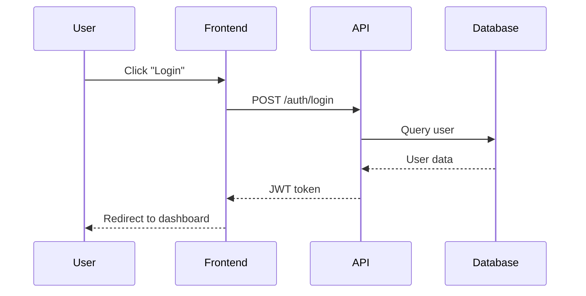

# Introduction

### TaskFlow

TaskFlow is a fictional project management tool.

Product overview:

* Web-based project management software
* Users: Project managers, team members, administrators
* Features: Task creation, team collaboration, time tracking, reporting
* Has a REST API for integrations

### How I use AI

As a technical writer, I use AI to generate initial draft content such as text, code, and diagrams.

#### Initial drafts

Take a document and let AI generate:

1. A concept document
2. A task document
3. A tutorial document
4. A reference document

Use AI to generate first drafts and apply rules from a style guide. I then edit and rewrite where necessary.

Use AI to improve writing clarity.

**What I have learned about AI-generated documentation:**

* AI is not good at writing tutorials or knowing when a user may need more guidance.&#x20;
* AI makes assumptions about a user's knowledge so sometimes skips steps or shortens them.
* AI does not always follow a style guide perfectly, so double-checking style afterwards is a must.
* AI can sometimes write things in a wordy way, so rewriting is often necessary.
* AI can sometimes make things up (hallucinate).
* AI can mix up concept, task, and reference, so if a document needs to have one intent, you must verify that AI did not add different information types to that document.
* You need to tell AI the exact format in which you want a document output.

The bottom-line is that AI-generated documents can't be used as is. Once generated, a technical writer needs to edit them for intent, style, accuracy, consistency, and usefulness.

#### Code

I use AI to generate code samples and then review them.

What I've learned is that AI tends to write sloppy code if you are not specific enough in your prompts. For example, AI might not add error-handling if you don't specify that. AI can also introduce bugs by forgetting to add a bracket or two somewhere.

#### Time-consuming tasks

Use AI to perform miscellaneous tasks that cost time, e.g. formatting tables.

### Tools

I use the following tools when writing technical documentation:

* Git
* GitHub
* Swagger/OpenAPI
* Visual Studio Code
* Mermaid
* Vale
* Hemingway Editor

### Documentation workflow

